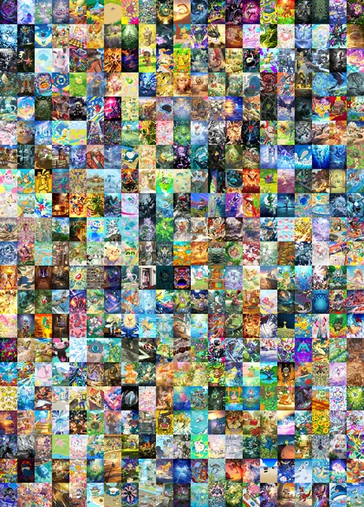
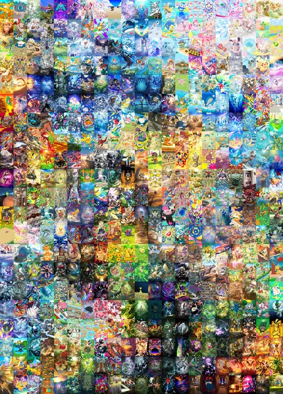

# Pokémon Mosaic

Assemble ~280 cartes Pokémon en une seule mosaïque géante, en cherchant l'agencement
où les **bords des cartes voisines se ressemblent le plus en couleur**, pour que
l'ensemble se lise comme une image continue plutôt qu'un patchwork.

Le but est l'**impression d'un poster** : soit une seule grande feuille, soit
plusieurs accolées. Sortie typique : une grille 17×17 sur un A2 à 300 DPI, soit une
image de **4961 × 7016 px**.

> **Projet non officiel**, sans lien avec Nintendo, Creatures ni The Pokémon
> Company. Les illustrations appartiennent à leurs ayants droit : le code de ce
> dépôt est libre, elles ne le sont pas.

| Départ, cartes tirées au hasard | Après optimisation |
|---|---|
|  |  |

Une grille 21×21, 441 cartes, montrée en vignette. Les illustrations sont
reproduites ici à titre d'illustration du résultat ; toute demande de leurs
ayants droit sera suivie de leur retrait.

## Comment ça marche

1. **Vignettes** : chaque carte est chargée directement en vignette réduite (25 %,
   soit 178 × 246), toutes ramenées à la taille de la plus petite carte trouvée. Les
   images pleine résolution ne sont relues du disque qu'à l'export.
2. **Signature** : chaque carte est résumée à 4 vecteurs RGB : la couleur moyenne
   d'une bande de 10 % en haut, en bas, à gauche et à droite. 12 nombres par carte.
3. **Distances précalculées** : deux matrices N×N contiennent toutes les distances
   possibles entre bords (droite↔gauche et bas↔haut). Évaluer une couture devient une
   lecture de tableau.
4. **Score** : le coût d'une grille est la somme, sur chaque couture, de la distance
   entre le bord droit d'une carte et le bord gauche de sa voisine (idem
   verticalement). Plus bas = plus lisse.
5. **Optimisation** : descente stricte (*hill climbing*) : on tire deux zones au
   hasard, on échange, on ne garde que si le score local s'améliore. Seules les
   coutures touchées sont recalculées.

### Pourquoi travailler sur des vignettes

Les signatures ne sont que des moyennes de larges bandes, et réduire une image *est*
déjà un moyennage. L'erreur introduite est inférieure à **0,3 niveau de couleur sur
255**, pour des gains considérables :

| | Pleine résolution | Vignettes 25 % |
|---|---|---|
| Mémoire pour 280 cartes | 562 Mo | **35 Mo** |
| Chargement | ~30 s | **3,7 s** |
| Optimisation | 24 000 it/s | **127 000 it/s** |
| Rendu d'un aperçu | impossible | **5 ms** |

### Liens entre cartes

Certaines cartes doivent rester groupées. Un lien est un **rectangle plein**, de
trois cases de côté au plus : une ligne de trois est un 3×1, une colonne un 1×3,
un carré un 2×2. Un seul concept remplace horizontal, vertical et groupe.

Les tailles possibles sont donc 2, 3, 4, 6 et 9, **5, 7 et 8 cartes ne remplissent
aucun rectangle** d'au plus trois de côté.

Un bloc est **indivisible** : il ne se déplace que d'un seul tenant, et uniquement
vers une zone composée exclusivement de cartes libres. La contrainte est satisfaite
par construction, sans pénalité de score et sans ralentir l'optimisation, mesuré
sur les 441 cartes, un 3×3 laisse le taux d'acceptation à 0,55 % contre 0,60 % sans
aucun lien.

Son **ordre est optionnel** : imposé, la disposition est respectée à la lettre ;
libre, l'optimiseur peut pivoter le bloc d'un demi-tour et dispose de deux fois plus
de placements. ⚠️ Un demi-tour, pas un miroir : sur un carré, une carte va dans le
coin **opposé**.

Trois liens sont fournis d'office : Solgaleo-Lunala, Entei-Raikou, et la lignée
Méga-Jungko-ex / Massko / Arcko en colonne, la plus évoluée en haut.

## Installation

Nécessite Python 3.13 et [uv](https://docs.astral.sh/uv/).

```bash
uv sync
```

Le socle est volontairement minimal, **numpy et Pillow seulement**, soit 47 Mo. Pour
relancer les scripts de `experiments/`, qui dépendent encore d'opencv, scipy et
scikit-learn :

```bash
uv sync --extra experiments
```

### Ouvrir l'application distribuée

L'application n'est **pas signée** : un certificat coûte un abonnement annuel, pour
un outil personnel partagé à quelques personnes. Les systèmes protestent donc au
premier lancement, une fois par machine.

| | Ce qui s'affiche | Comment passer outre |
|---|---|---|
| **Linux** | rien | rien à faire |
| **Windows** | « Windows a protégé votre ordinateur », éditeur **Inconnu** | Cliquer **Informations complémentaires**, puis **Exécuter quand même** |
| **macOS** | « développeur non identifié » | **Clic droit** sur l'application → **Ouvrir**, puis confirmer |

⚠️ Sur Windows, **le seul bouton visible est « Ne pas exécuter »**. Le bouton qui
lance l'application n'apparaît qu'après avoir cliqué « Informations
complémentaires » : c'est là que les gens abandonnent, faute de voir qu'il y a une
issue.

⚠️ Sur macOS, un double-clic ordinaire ne propose **aucune** issue : il faut passer
par le clic droit.

Un antivirus peut par ailleurs signaler l'exécutable à tort. Les paquets produits
par PyInstaller déplient du code avant de le lancer, un schéma que les heuristiques
partagent avec les logiciels malveillants. C'est indépendant de la signature.

## Données

**Les images ne sont pas versionnées.** Elles se récupèrent en une commande :

```bash
uv run python scripts/fetch_cards.py
```

441 illustrations nues : sans cadre ni texte, 734×1024, 56,4 Mo. Le dépôt ne
contient que `cards.json`, qui dit quelles cartes le miroir porte.

La commande passe par le **miroir**, publié en *release* d'un dépôt dédié,
[pokemoncardsmosaic-images](https://github.com/ArielNora/pokemoncardsmosaic-images),
sous forme d'une archive par extension, dont l'empreinte est vérifiée, puis
celle de chaque image. C'est la seule voie qui donne à tout le monde exactement
les mêmes octets : un réencodage local dépendrait de la version de libwebp
installée.

C'est la **seule** provenance du projet : rien n'y va chercher une image sur un
site tiers. Pour prendre le catalogue publié plutôt que le fichier local, et
voir ainsi les cartes ajoutées depuis :

```bash
uv run python scripts/fetch_cards.py --online
```

Voir `docs/IMAGES.md`.

Relancer la commande ne récupère que ce qui manque ou ne correspond plus à son
empreinte : elle est reprenable après une interruption. Pour contrôler sans rien
écrire :

```bash
uv run python scripts/fetch_cards.py --check
```

Les fichiers arrivent dans `data/pokemoncards/`, un dossier par extension :

```
data/pokemoncards/
├── a1-puissance-genetique/
│   ├── a1-227-bulbizarre.webp
│   └── ...
├── a1a-l-ile-fabuleuse/
└── ...
```

### À l'arrivée d'une nouvelle extension

Côté **utilisateur**, rien à faire de particulier : le bouton « Mettre à jour le
catalogue » de l'étape 1 relit `cards.json` depuis le miroir et ne télécharge que
les extensions incomplètes.

Côté **mainteneur**, les illustrations sont déposées à la main dans
`data/pokemoncards/<extension>/`, puis :

```bash
uv run python scripts/build_manifest.py    # met cards.json à jour
uv run python scripts/publish_release.py   # publie archives et catalogue
```

`build_manifest.py` ne lit que le disque. Il conserve la rareté et les noms des
cartes déjà décrites, et **nomme** ceux qui manquent pour une carte nouvelle
plutôt que de les deviner. Voir `docs/IMAGES.md`.

Le catalogue retient les cartes dont l'illustration occupe toute la carte : les
trois raretés étoilées.

Les noms sont en français quand le catalogue les a, en anglais sinon, 440 des
441 à ce jour. Ils ne servent qu'à nommer les fichiers : l'illustration est nue,
sans texte incrusté.

### Utiliser un autre jeu d'images

Le dossier est parcouru récursivement et accepte `.webp`, `.png`, `.jpg`,
`.bmp` et `.tif`. Un fichier par carte, l'organisation en sous-dossiers ne sert
qu'à filtrer dans l'interface.

## Utilisation

```bash
uv run pokemon-mosaic
```

Options utiles :

```bash
uv run pokemon-mosaic --iterations 50000 --preview-percent 25
```

| Option | Défaut | Rôle |
|---|---|---|
| `--data-dir` | `data/pokemoncards` | Dossier racine des cartes |
| `--output-dir` | `output/` | Où écrire la mosaïque |
| `--iterations` | `1000000` | Itérations d'optimisation |
| `--strip-size` | `0.1` | Épaisseur des bandes de bord (fraction) |
| `--grid` | auto | Grille explicite, ex. `17x17` |
| `--free-order` | non | Autoriser l'optimiseur à retourner les cartes liées |
| `--full-resolution` | non | Exporter en pleine résolution |
| `--preview-percent` | `15` | Taille de l'aperçu réduit |

### Recuit simulé

La descente stricte n'accepte jamais un échange qui dégrade le score, et plafonne
donc dans un minimum local. Le recuit en accepte parfois un, avec une probabilité qui
décroît au fil du calcul :

```bash
uv run pokemon-mosaic --annealing --iterations 1000000
```

| Itérations | Descente stricte | Recuit simulé |
|---|---|---|
| 50 000 | 56,3 % | **59,4 %** |
| 200 000 | 59,5 % | **64,8 %** |
| 1 000 000 | 61,0 % | **67,5 %** |

L'écart se creuse avec la durée : plus le recuit a de temps, plus il prend l'avantage.
La température se calibre toute seule à partir de l'ampleur réelle des dégradations,
le seul réglage exposé est `--acceptance`, la proportion de coups dégradants acceptés
au démarrage.

### Seuils d'arrêt et timeline

```bash
uv run pokemon-mosaic --annealing --stagnation 50000 --time-budget 30 --snapshot-every 10
```

`--target-score`, `--stagnation`, `--time-budget` arrêtent le calcul dès qu'une
condition est remplie. `--snapshot-every` enregistre l'état de la grille tous les N
**échanges retenus** : pas toutes les N tentatives, car le taux d'acceptation varie
de 0,3 % (descente stricte) à 8 % (recuit). La cadence s'adapte d'elle-même pour que
la timeline reste bornée et régulièrement répartie.

### Export poster

Avec `--paper`, la sortie devient un vrai poster : la taille des cartes se déduit du
format et du DPI, les cartes gardent leurs proportions exactes, et l'image est centrée
 la marge résiduelle absorbe l'écart de rapport entre la grille et la feuille.

```bash
uv run pokemon-mosaic --grid 17x17 --paper A2 --dpi 300 --full-resolution --format jpg
```

Découpage en plusieurs posters, avec chevauchement pour le collage et repères de
coupe. La coupe tombe toujours sur un bord de carte, donc le nombre de colonnes doit
être divisible par le nombre de panneaux :

```bash
uv run pokemon-mosaic --grid 24x12 --paper A3 --panels 2 --overlap 5 --crop-marks --format pdf
```

| Option | Défaut | Rôle |
|---|---|---|
| `--paper` | aucun | Format d'impression, `A0` à `A6` |
| `--landscape` | non | Feuille en paysage |
| `--dpi` | `300` | Résolution d'impression |
| `--panels` | `1` | Nombre de posters côte à côte |
| `--overlap` | `0` | Chevauchement entre panneaux, en mm |
| `--crop-marks` | non | Repères de coupe |
| `--format` | `png` | `png`, `jpg` ou `pdf` |

Le PDF porte les **dimensions physiques** de la page, ce qui lève toute ambiguïté
chez l'imprimeur. L'app prévient si le DPI demandé dépasse le maximum utile, au-delà,
les cartes sont agrandies sans gagner en détail (366 DPI en A0, 733 en A2).

Chaque panneau est rendu séparément : le poster complet n'est jamais en mémoire d'un
seul tenant, ce qui évite les 836 Mo d'un A0 en deux panneaux.

### Cases vides

Avec `--grid`, les cases excédentaires deviennent des **cases vides figées**,
réparties régulièrement et jamais déplacées par l'optimisation. L'app annonce alors
combien de cartes ajouter pour remplir exactement la grille :

```bash
uv run pokemon-mosaic --grid 17x17
```
```
280 cartes pour 289 cases (17×17) : il restera 9 cases vides.
Ajoutez 9 cartes pour remplir la grille.
```

Compter environ **4 s de chargement** des cartes, puis l'optimisation à ~127 000
itérations/s, soit 8 s pour un million. Les sorties vont dans `output/`, non versionné.

## Interface graphique

```bash
uv run pokemon-mosaic-ui
```

Assistant en trois étapes puis vue d'exécution, **toutes disponibles**.

### Étape 1 : cartes

Galerie des 280 vignettes, inclusion/exclusion par carte, par dossier ou en totalité.

Le chargement est **progressif** : les dossiers apparaissent les uns après les autres
au lieu d'attendre la fin. La première passe ne lit que les en-têtes des fichiers pour
déterminer la taille commune des vignettes, 80 ms, puis chaque extension est livrée
dès qu'elle est décodée, sur les ~3,5 s que dure le décodage complet.

Sélectionner un dossier **filtre la galerie** sur ses seules cartes ; les boutons
*Inclure* et *Exclure* agissent alors sur ce dossier. Le filtre survit à l'arrivée des
dossiers suivants.

### Étape 2 : grille et format

Format d'impression (A0 à A6, portrait ou paysage), résolution, nombre de posters
côte à côte, dimensions de grille. La taille des cartes en pixels **s'en déduit** :
le format commande.

L'**aperçu fil de fer** montre la géométrie sans les images, feuille, marges,
contours des cartes, lignes de coupe entre panneaux. Cliquer une case y place ou
retire un vide. Le nombre de vides étant fixé par la grille et la sélection, poser un
vide supplémentaire fait céder sa place au plus ancien.

Une liste propose les **grilles adaptées** au format choisi, avec l'écart de
proportions et le nombre de cartes à ajouter ou retirer. Les avertissements signalent
les cases vides, un DPI au-delà du maximum utile, ou une image trop lourde à exporter.

L'interface est **bilingue français / anglais**, avec un sélecteur en bas de fenêtre.
Les textes sont écrits en français dans le code et traduits par des fichiers Qt.
Après avoir ajouté ou modifié une chaîne :

```bash
uv run pyside6-lupdate src/pokemon_mosaic/ui/*.py -ts translations/pokemon_mosaic_en.ts
uv run pyside6-lrelease translations/pokemon_mosaic_en.ts
```

⚠️ `lupdate` n'extrait que les `tr()` portant une chaîne **littérale**. Un
`self.tr(variable)` passe inaperçu et reste non traduit, voir `MainWindow.step_title`
pour le contournement.

## Structure

```
src/pokemon_mosaic/
├── cards.py      chargement en vignettes, signatures de bord
├── links.py      liens entre cartes et bibliothèque de liens
├── layout.py     formats d'impression, ajustement, cases vides
├── grid.py       dimensionnement de la grille, rendu
├── scoring.py    matrices de distances, score global et local
├── annealing.py  recuit simulé et calibration de température
├── timeline.py   snapshots de l'exécution
├── export.py     poster, panneaux, marges, PNG / JPEG / PDF
├── optimize.py   boucle d'optimisation, contraintes, seuils d'arrêt
├── imaging.py    inspection et réduction des images produites
└── cli.py        point d'entrée

tests/            tests du cœur de calcul
experiments/      approches alternatives, conservées mais non maintenues
```

Tests et analyse statique :

```bash
uv run --extra dev pytest
uv run --extra dev ruff check src tests
```

### experiments/

Trois pistes antérieures, gardées pour référence. Aucune n'est sur le chemin
principal, aucune ne s'exécute à l'import.

- **`greedy_edge_matching.py`** : remplissage case par case en prenant à chaque fois
  la meilleure carte restante. Rapide mais myope : les dernières cases héritent des
  rebuts. C'est ce défaut qui a motivé l'optimisation par échanges.
- **`soft_adjacency_penalty.py`** : l'adjacence forcée par pénalité de score
  (`distance × 5000`) plutôt que par blocs. Oblige à recalculer le score global à
  chaque itération : trop lent, abandonné.
- **`tsne_assignment.py`** : approche entièrement différente : t-SNE sur les pixels
  bruts puis affectation optimale par algorithme hongrois. Regroupe par ressemblance
  globale au lieu de lisser les coutures. Jamais branché sur un point d'entrée.

## Limitations connues

Documentées dans le code, non corrigées à ce stade, voir [TODO.md](TODO.md).

- **La forme de la grille dépend de la factorisation du nombre de cartes.** 280 donne
  20×14, mais 281 est premier et donnerait une bande 281×1 de 200 000 px de large.
  C'est la seule raison pour laquelle une carte est exclue par défaut. L'application
  à venir rendra la grille explicite et autorisera les cases vides, ce qui supprime
  le problème.
- **La transparence est ignorée.** La majorité des cartes sont en RGBA et certaines
  ont de la vraie transparence, écartée sans composition sur un fond.

Deux limitations précédentes ont disparu avec la refonte du cœur : les indices ne
peuvent plus se désynchroniser (ils sont attribués à l'insertion), et la couture
partagée entre deux zones échangées n'est plus comptée deux fois (les deux zones sont
évaluées en un seul appel).

## Licence

Le code est sous licence [MIT](LICENSE). Cela ne couvre **que le code** : les
illustrations des cartes ne m'appartiennent pas et ne sont concédées par
personne ici.
